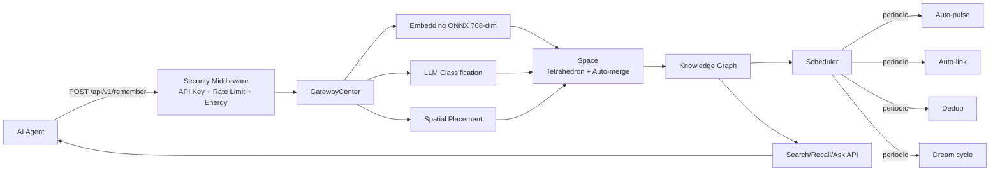

# Architecture

Epicode is a spatial AI memory system that stores memories as regular tetrahedrons in continuous 3D space. This document describes the system architecture, including data flow, spatial model, and concurrency model.

## Overview

Epicode processes incoming memories through a pipeline of security checks, embedding computation, spatial placement, and background maintenance. The system is designed to give AI agents persistent, cross-session memory capabilities with automatic relationship extraction and semantic search.

## Data Flow

The following diagram illustrates how a memory flows through the system from ingestion to retrieval:



```text
AI Agent → POST /remember → Security Middleware (API Key + Rate Limit + Energy Check)
    → GatewayCenter (Embedding → LLM Classification → Spatial Placement)
    → New Tetrahedron placed into Space (Auto-merge nearby vertices → Natural clustering)
    → Knowledge Graph updated
    → Scheduler runs periodically: Auto-pulse / Auto-link / Deduplication / Dream cycle
```

### Ingestion Path

1. **Security Middleware** validates the API key, enforces rate limits, and checks the user's energy balance.
2. **GatewayCenter** computes an embedding vector for the content, classifies it via LLM, and determines spatial placement.
3. **Space** receives the new tetrahedron and automatically merges nearby vertices, forming natural clusters (polyhedra).
4. **Knowledge Graph** is updated with newly extracted relationships.

### Background Maintenance

The scheduler periodically runs the following tasks:

- **Auto-pulse** — propagates activation signals through the topology to strengthen frequently accessed memories.
- **Auto-link** — discovers and creates new relationships between semantically similar memories.
- **Deduplication** — identifies and merges duplicate or near-duplicate memories.
- **Dream cycle** — consolidates memories and prunes weak connections during low-activity periods.

## Spatial Model

Memories are stored as **regular tetrahedrons** (uniform edge length 1.0) in a continuous 3D space. This geometric representation enables natural clustering and topological operations.

### Tetrahedron Clustering

Tetrahedrons that share vertices naturally cluster into polyhedra. This physical clustering provides:

- **Implicit grouping** — memories with shared concepts are spatially adjacent.
- **Efficient traversal** — navigating from one memory to related memories is a local graph operation.
- **Structural stability** — the rigid geometry of tetrahedrons resists arbitrary distortion.

### Central Hollow Cylinder

A central hollow cylinder acts as the system hub, organized into four layers:

| Layer | Purpose |
|-------|---------|
| **Instinct** | Reflexive responses, hard-coded patterns, survival-level behaviors |
| **Cognition** | Reasoning, inference, and dynamic thought processes |
| **Service** | Operational utilities, tool execution, and external integrations |
| **Identity** | Self-model, persistent preferences, and long-term personality |

Ports on the cylinder connect to external polyhedron clusters via a **star topology**.

### Pulse Propagation

Activation signals (pulses) travel through the topology in a defined path:

```
Instinct layer port → External polyhedron cluster → Same port returns
```

This cyclic propagation ensures that activation spreads through related memories while maintaining a predictable flow pattern. Pulses strengthen connections along their path, implementing a form of Hebbian learning.

## Concurrency Model

Epicode uses a hybrid concurrency model combining Rust's ownership system with async runtime primitives.

### Domain State Locking

Core domain structures use interior mutability via `RwLock`:

- **Space** — the 3D tetrahedron container.
- **Cylinder** — the central hollow cylinder hub.
- **KnowledgeGraph** — the relationship graph.

Read-heavy operations (search, recall, stats) acquire read locks. Write operations (remember, update, delete) acquire write locks. This design maximizes read parallelism while serializing writes.

### Event-Driven Communication

Engine subsystems communicate asynchronously through a `broadcast::EventBus`:

- Events are fire-and-forget broadcasts to all interested subscribers.
- Subsystems react to events independently without blocking the publisher.
- This decouples the ingestion pipeline from background maintenance tasks.

### Background Tasks

Long-running and periodic work is executed via `tokio::task`:

- The scheduler spawns tasks for dream cycles, pulse propagation, and deduplication.
- Tasks are cooperative and yield control to the async runtime.
- CPU-intensive work (ONNX embedding inference) runs on dedicated threads to avoid blocking the async executor.

## Related Documentation

- [API Reference](api-reference.md) — HTTP endpoints and MCP tools.
- [MCP Protocol](mcp-protocol.md) — Model Context Protocol integration details.
- [Configuration](configuration.md) — Environment variables and deployment settings.
- [Development Guide](development.md) — Local setup, testing, debugging.
- [Deployment Guide](deployment.md) — Production deployment, TLS, monitoring.

## Legacy Compatibility

Epicode was previously named Tetramem. The following legacy artifacts are preserved for backward compatibility and will be removed in a future major release (2.0):

| Artifact | Location | Status |
|----------|----------|--------|
| `tetramem.db` database filename | `backend/src/engine/storage.rs` | Renamed to `epicode.db` in v2.0; migration script provided at release |
| `TETRAMEM_*` environment variable prefix | Multiple `env_var()` helpers | Accepted as fallback; `EPICODE_*` preferred |
| `tetramem-sdk` package name | README deprecation notice only | Already renamed to `epicode-sdk` |

**Migration path (planned for v2.0)**:
1. Backend auto-detects `tetramem.db` and renames to `epicode.db` on startup
2. `TETRAMEM_*` env vars emit deprecation warning, still accepted
3. v2.1 removes `TETRAMEM_*` fallback entirely
