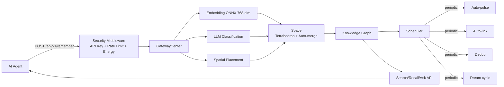

# Architecture

Epicode is a spatial AI memory system that stores memories as regular tetrahedrons in continuous 3D space. This document describes the system architecture, including data flow, spatial model, and concurrency model.

## Overview

Epicode processes incoming memories through a pipeline of security checks, embedding computation, spatial placement, and background maintenance. The system is designed to give AI agents persistent, cross-session memory capabilities with automatic relationship extraction and semantic search.

## Data Flow

The following diagram illustrates how a memory flows through the system from ingestion to retrieval:


```mermaid
flowchart LR
    A[AI Agent] -->|POST /api/v1/remember| B[Security Middleware<br/>API Key + Rate Limit + Energy]
    B --> C[GatewayCenter]
    C --> D[Embedding ONNX 768-dim]
    C --> E[LLM Classification]
    C --> F[Spatial Placement]
    D & E & F --> G[Space<br/>Tetrahedron + Auto-merge]
    G --> H[Knowledge Graph]
    H --> I[Scheduler]
    I -->|periodic| J[Auto-pulse]
    I -->|periodic| K[Auto-link]
    I -->|periodic| L[Dedup]
    I -->|periodic| M[Dream cycle]
    H --> N[Search/Recall/Ask API]
    N --> A
```

```text
AI Agent → POST /remember → Security Middleware (API Key + Rate Limit + Energy Check)
    → GatewayCenter (Embedding → LLM Classification → Spatial Placement)
    → New Tetrahedron placed into Space (Auto-merge nearby vertices → Natural clustering)
    → Knowledge Graph updated
    → Scheduler runs periodically: Auto-pulse / Auto-link / Deduplication / Dream cycle
```

### Ingestion Path

1. **Security Middleware** validates the API key, enforces rate limits, and checks the user's energy balance.
2. **GatewayCenter** computes an embedding vector for the content, classifies it via LLM, and determines spatial placement.
3. **Space** receives the new tetrahedron and automatically merges nearby vertices, forming natural clusters (polyhedra).
4. **Knowledge Graph** is updated with newly extracted relationships.

### Background Maintenance

The scheduler periodically runs the following tasks:

- **Auto-pulse** — propagates activation signals through the topology to strengthen frequently accessed memories.
- **Auto-link** — discovers and creates new relationships between semantically similar memories.
- **Deduplication** — identifies and merges duplicate or near-duplicate memories.
- **Dream cycle** — consolidates memories and prunes weak connections during low-activity periods.

## Spatial Model

Memories are stored as **regular tetrahedrons** (uniform edge length 1.0) in a continuous 3D space. This geometric representation enables natural clustering and topological operations.

### Tetrahedron Clustering

Tetrahedrons that share vertices naturally cluster into polyhedra. This physical clustering provides:

- **Implicit grouping** — memories with shared concepts are spatially adjacent.
- **Efficient traversal** — navigating from one memory to related memories is a local graph operation.
- **Structural stability** — the rigid geometry of tetrahedrons resists arbitrary distortion.

### Central Hollow Cylinder

A central hollow cylinder acts as the system hub, organized into six layers:

| Layer | Purpose |
|-------|---------|
| **Instinct** | Reflexive responses, hard-coded patterns, survival-level behaviors |
| **Relation** | Connected entities and knowledge graph structure |
| **Cognition** | Reasoning, inference, and dynamic thought processes |
| **Service** | Operational utilities, tool execution, and external integrations |
| **Cycle** | Proactive and recurring activity |
| **Identity** | Self-model, persistent preferences, and long-term personality |

Ports on the first five layers connect to external polyhedron clusters via a **star topology**; the Identity layer currently has no Ports. A seed tetrahedron can share a Port vertex geometrically. When an existing cluster is too far away, reseeding creates an explicit logical Port-to-tetra entry edge instead of moving or distorting its geometry. Pulses traverse either kind of edge. The logical edge is rebuilt in stable cluster order when the engine loads, so a distant cluster remains reachable after restart without claiming that it physically touches the cylinder.

### Pulse Propagation

Activation signals (pulses) travel through the topology in a defined path:

```
Instinct layer port → External polyhedron cluster → Same port returns
```

This cyclic propagation ensures that activation spreads through related memories while maintaining a predictable flow pattern. Pulses strengthen connections along their path, implementing a form of Hebbian learning.

## Concurrency Model

Epicode uses a hybrid concurrency model combining Rust's ownership system with async runtime primitives.

### Domain State Locking

Core domain structures use interior mutability via `RwLock`:

- **Space** — the 3D tetrahedron container.
- **Cylinder** — the central hollow cylinder hub.
- **KnowledgeGraph** — the relationship graph.

Read-heavy operations (search, recall, stats) acquire read locks. Write operations (remember, update, delete) acquire write locks. This design maximizes read parallelism while serializing writes.

### Search Read Path

BM25 document frequencies and tokenized documents are cached against a per-space searchable-memory revision. Inserts, deletes, and content or alias edits invalidate the cache; warm HNSW and label-index searches fetch only candidate memories by ID rather than cloning the full space. The existing bounded no-candidate fallback and exact-mode full fallback remain in place. Scoring, filters, and SMRP payloads are unchanged.

### Event-Driven Communication

Engine subsystems communicate asynchronously through a `broadcast::EventBus`:

- Events are fire-and-forget broadcasts to all interested subscribers.
- Subsystems react to events independently without blocking the publisher.
- This decouples the ingestion pipeline from background maintenance tasks.

### Background Tasks

Long-running and periodic work is executed via `tokio::task`:

- The scheduler loop sequences pulse, fission, dream, eviction, and persistence maintenance.
- Cloud startup atomically claims one scheduler loop per user, and `SchedulerCenter` rejects duplicate loop starts. Scheduler cycles use single-flight admission; full cognitive cycles run on the blocking pool, and if a cycle outlives its interval, later ticks are skipped rather than queued.
- Self-driving selects `Explore` signals before applying its three-signal cycle limit, leaving other pending signal types available to external consumers.
- The async loop remains available for events and shutdown while a full cognitive cycle is running.
- CPU-intensive work (ONNX embedding inference) runs on dedicated threads to avoid blocking the async executor.

### Graph and Library Persistence

Each user's knowledge graph is stored with that user's memory database. Incremental edge changes are coalesced by directed edge and relation type, then saved transactionally with the current concept snapshot. Bulk relation decay uses a full graph snapshot so changed strengths are not lost when no edge is removed.

Concept snapshots persist the full unique tetra membership; `member_count` is derived from that set. Older databases did not persist membership IDs, so startup rebuilds their derived prototypes from stored tetra labels when those memories load successfully. This may regenerate concept labels/IDs, but does not alter memory records or relations. Older standalone graph snapshots cannot be repaired until a full tetra-label snapshot is supplied, so their unknown counts are preserved rather than silently undercounted.

The Cloud L1 library database is stored as `library.db` in the configured data directory. Its shared HNSW index is rebuilt from persisted chunk embeddings during startup. Cloud startup fails if the persistent library cannot be opened; it does not accept writes into a volatile in-memory substitute.

## Related Documentation

- [API Reference](api-reference.md) — HTTP endpoints and MCP tools.
- [MCP Protocol](mcp-protocol.md) — Model Context Protocol integration details.
- [Configuration](configuration.md) — Environment variables and deployment settings.
- [Development Guide](development.md) — Local setup, testing, debugging.
- [Deployment Guide](deployment.md) — Production deployment, TLS, monitoring.

## Legacy Compatibility

Epicode was previously named Tetramem. The following legacy artifacts are preserved for backward compatibility and will be removed in a future major release (2.0):

| Artifact | Location | Status |
|----------|----------|--------|
| `tetramem.db` database filename | `backend/src/engine/storage.rs` | Renamed to `epicode.db` in v2.0; migration script provided at release |
| `TETRAMEM_*` environment variable prefix | Multiple `env_var()` helpers | Accepted as fallback; `EPICODE_*` preferred |
| `tetramem-sdk` package name | README deprecation notice only | Already renamed to `epicode-sdk` |

**Migration path (planned for v2.0)**:
1. Backend auto-detects `tetramem.db` and renames to `epicode.db` on startup
2. `TETRAMEM_*` env vars emit deprecation warning, still accepted
3. v2.1 removes `TETRAMEM_*` fallback entirely
