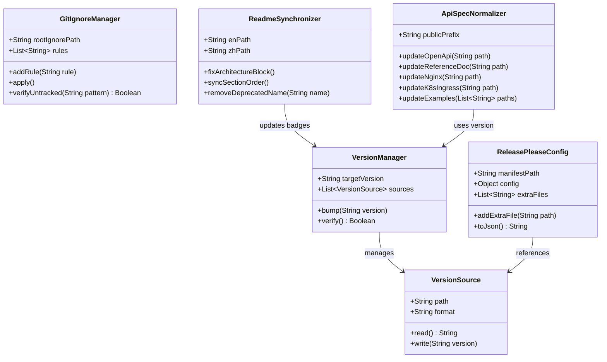
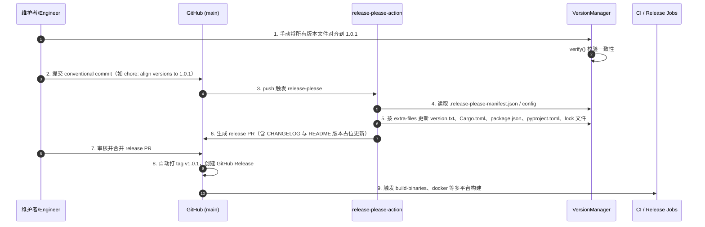
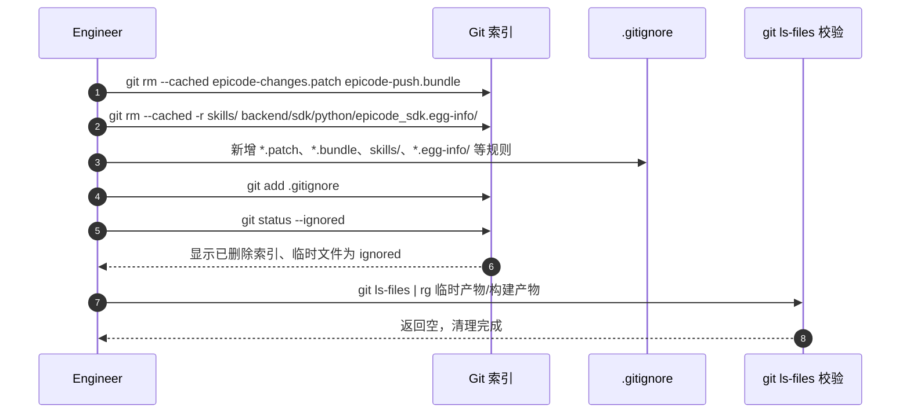
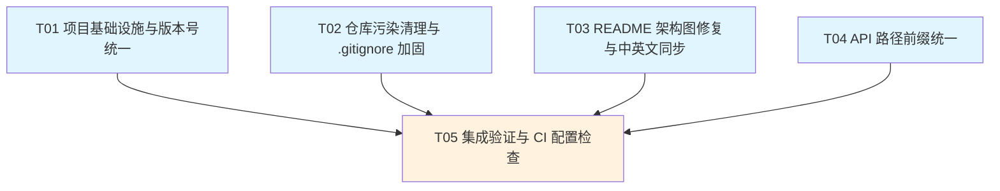

# Epicode 开源仓库成熟度提升 Sprint 1 系统设计

> 目标版本号：`1.0.1`  
> Sprint 范围：P0-1、P0-2、P0-3、P0-4  
> 设计输出：`docs/design/open-source-sprint1-design.md`

---

## Part A：系统设计与实现方案

### 1. 实现方案概述

| P0 项 | 核心思路 | 关键步骤 |
|------|---------|---------|
| **P0-1 统一版本号并修复 release-please** | 以 `.release-please-manifest.json` + `CHANGELOG.md` 为唯一版本源，所有代码/制品文件对齐到 `1.0.1`；让 release-please 在后续迭代中自动同步所有版本文件。 | 1. 修改 `version.txt`、`backend/Cargo.toml`、`guard/Cargo.toml`、`frontend/package.json`、`frontend/package-lock.json`、`backend/sdk/python/pyproject.toml`、`backend/sdk/typescript/package.json`（及 lock）为 `1.0.1`。<br>2. `.release-please-manifest.json` 改为 `1.0.1`。<br>3. `.release-please-config.json` 的 `extra-files` 新增 `version.txt`、两个 SDK 的 `package.json`/`pyproject.toml`、`frontend/package-lock.json`。<br>4. 保留/补充 `# x-release-please-version` 注释，便于人工识别。 |
| **P0-2 清理仓库污染并加固 `.gitignore`** | 使用 `git rm --cached` 从索引移除已跟踪的临时/构建产物，不 rewrite 历史；通过 `.gitignore` 防止再次误提交。 | 1. `git rm --cached epicode-changes.patch epicode-push.bundle`。<br>2. `git rm --cached -r skills/ backend/sdk/python/epicode_sdk.egg-info/`。<br>3. 根目录 `.gitignore` 新增 `*.patch`、`*.bundle`、`.pytest_cache/`、`.workbuddy/`、`deliverables/`、`mcp-bridge/`、`skills/`、`overview.md`、Python 构建产物规则。<br>4. 新增 `backend/sdk/python/.gitignore`。<br>5. 运行 `git ls-files` 校验无 patch/bundle/egg-info/skills。 |
| **P0-3 修复 README 架构图与中英文同步** | 以英文 README 为母版，修复 Architecture 文本块截断/重复；中文 README 补齐章节并统一顺序；清理旧名 `tetramem-sdk`。 | 1. 合并两段分离的 Architecture 文本为完整数据流图。<br>2. 中文 README 统一为：快速开始 → 核心特性 → 架构 → 技术栈 → 本地开发 → Docker 部署 → 文档 → SDK → 社区 → 许可证。<br>3. 同步代码示例、链接、badge。<br>4. 删除/替换 `tetramem-sdk` 引用；TS SDK 入口文件从 `tetramem.ts` 重命名为 `epicode.ts`，`package.json` 的 `main`/`types` 同步更新。 |
| **P0-4 统一 API 路径前缀** | 公开 API 统一为 `/api/v1`；文档、OpenAPI、Nginx、K8s Ingress、示例脚本保持一致；后端路由保持 `/v1/...` 内部前缀，由 Nginx 剥离 `/api`。 | 1. `docs/api-reference.md`：Base URL 改为 `https://epicode.cn/api/v1`，端点表改为 `/remember`、`/search` 等（去掉重复 `/v1`）。<br>2. `backend/docs/openapi.yaml`：`info.version=1.0.1`，`servers.url` 改为 `/api/v1`，`paths` 中 `/v1/...` 改为 `/...`；`/health`、`/stats/public` 等保留。<br>3. `deploy/nginx.conf` 与 `deploy/kubernetes/epicode.yaml` 保持 `/api` 路由前缀，并补充注释说明公开前缀为 `/api/v1`。<br>4. 示例脚本与文档中的 base URL 统一为 `http://localhost:8080/api/v1`。 |

**技术选型说明**：

- **版本管理**：继续使用 Google `release-please-action@v4`（`release-type: simple`），通过 `extra-files` 机制同步多语言/多包版本，无需引入额外工具。
- **仓库清理**：仅使用 `git rm --cached` + `.gitignore`，避免 `git filter-repo` 重写历史带来的协作风险。
- **文档同步**：README 采用“英文母版 + 中文镜像”的人工维护策略，本次 Sprint 手动对齐；后续可考虑 P2 引入自动化 diff/校验脚本。
- **API 前缀**：采用“Nginx 剥离 `/api`，后端监听 `/v1/...`”的现有架构，改动最小且与 README 示例一致。

---

### 2. 文件列表

#### 2.1 P0-1 版本号统一

| 相对路径 | 操作 | 关键变更 |
|----------|------|----------|
| `version.txt` | 修改 | `1.0.0` → `1.0.1` |
| `backend/Cargo.toml` | 修改 | `version = "1.0.0"` → `"1.0.1"` |
| `guard/Cargo.toml` | 修改 | `version = "1.0.0"` → `"1.0.1"` |
| `frontend/package.json` | 修改 | `"version": "1.0.0"` → `"1.0.1"` |
| `frontend/package-lock.json` | 修改 | 顶层 `version` 字段改为 `1.0.1` |
| `backend/sdk/python/pyproject.toml` | 修改 | `version = "1.0.0"` → `"1.0.1"` |
| `backend/sdk/typescript/package.json` | 修改 | `version`、`name`（`tetramem-sdk` → `epicode-sdk`） |
| `backend/sdk/typescript/package-lock.json` | 修改 | `name`/`version` 改为 `epicode-sdk`/`1.0.1` |
| `.release-please-manifest.json` | 修改 | `".": "1.1.0"` → `"1.0.1"` |
| `.release-please-config.json` | 修改 | `extra-files` 增加 `version.txt`、SDK 与 lock 文件 |
| `backend/docs/openapi.yaml` | 修改 | `info.version`：`1.0.0` → `1.0.1`（P0-4 同步处理） |

#### 2.2 P0-2 仓库清理

| 相对路径 | 操作 | 说明 |
|----------|------|------|
| `.gitignore` | 修改 | 新增临时/构建产物规则 |
| `backend/.gitignore` | 修改 | 新增 `*.egg-info/`、`__pycache__/`、`.pytest_cache/` 等 |
| `frontend/.gitignore` | 可选修改 | 保持现状已足够 |
| `backend/sdk/python/.gitignore` | 新增 | Python SDK 专用忽略规则 |
| `epicode-changes.patch` | 从索引移除 | `git rm --cached`，本地保留 |
| `epicode-push.bundle` | 从索引移除 | `git rm --cached`，本地保留 |
| `skills/README.md` | 从索引移除 | `git rm --cached -r skills/` |
| `skills/react-state-management.md` | 从索引移除 | 同上 |
| `skills/rust-error-handling.md` | 从索引移除 | 同上 |
| `backend/sdk/python/epicode_sdk.egg-info/` | 从索引移除 | 已跟踪的 Python 构建产物 |

#### 2.3 P0-3 README 修复

| 相对路径 | 操作 | 说明 |
|----------|------|------|
| `README.md` | 修改 | 修复 Architecture 块、同步 SDK 说明、清理旧名 |
| `README.zh.md` | 修改 | 补齐/重排章节，与英文版对齐 |
| `backend/sdk/typescript/README.md` | 修改 | 清理 `tetramem-sdk` 引用，同步入口文件名 |
| `backend/sdk/typescript/src/tetramem.ts` | 重命名 | → `backend/sdk/typescript/src/epicode.ts` |
| `backend/sdk/typescript/package.json` | 修改 | `main`/`types`：`dist/tetramem.js` → `dist/epicode.js` |
| `backend/sdk/typescript/tsconfig.json` | 检查/修改 | 若 `outFile`/`include` 硬编码文件名则同步 |

#### 2.4 P0-4 API 路径统一

| 相对路径 | 操作 | 说明 |
|----------|------|------|
| `docs/api-reference.md` | 修改 | Base URL `/api/v1`，端点表去 `/v1` 重复前缀 |
| `backend/docs/openapi.yaml` | 修改 | `servers.url=/api/v1`，`paths` 去掉 `/v1` |
| `deploy/nginx.conf` | 修改 | 保留 `/api/` 反向代理，补充注释 |
| `deploy/kubernetes/epicode.yaml` | 修改 | Ingress `/api` 路径保留，补充注释 |
| `docs/examples.md` | 修改 | base URL 改为 `http://localhost:8080/api/v1` |
| `examples/curl/quickstart.sh` | 修改 | `BASE_URL` 默认改为 `http://localhost:8080/api/v1` |
| `examples/node/basic-memory.mjs` | 修改 | base URL 同步 |
| `examples/python/basic_memory.py` | 修改 | base URL 同步 |
| `examples/python/ai_agent_memory.py` | 修改 | base URL 同步 |

---

### 3. 数据结构与接口

#### 3.1 配置 schema 示例

**`.release-please-config.json`（目标态）**

```json
{
  "packages": {
    ".": {
      "release-type": "simple",
      "include-component-in-tag": false,
      "extra-files": [
        "version.txt",
        "backend/Cargo.toml",
        "guard/Cargo.toml",
        {
          "type": "json",
          "path": "frontend/package.json",
          "jsonpath": "$.version"
        },
        {
          "type": "json",
          "path": "frontend/package-lock.json",
          "jsonpath": "$.version"
        },
        {
          "type": "json",
          "path": "backend/sdk/typescript/package.json",
          "jsonpath": "$.version"
        },
        {
          "type": "json",
          "path": "backend/sdk/typescript/package-lock.json",
          "jsonpath": "$.version"
        },
        "backend/sdk/python/pyproject.toml",
        "README.md",
        "README.zh.md"
      ],
      "changelog-sections": [
        { "type": "feat", "section": "Features" },
        { "type": "fix", "section": "Bug Fixes" },
        { "type": "docs", "section": "Documentation" },
        { "type": "perf", "section": "Performance Improvements" },
        { "type": "security", "section": "Security" }
      ],
      "draft": false,
      "prerelease": false
    }
  }
}
```

**`.release-please-manifest.json`（目标态）**

```json
{ ".": "1.0.1" }
```

**根目录 `.gitignore` 新增段（目标态示例）**

```gitignore
# Temporary / local artifacts
*.patch
*.bundle
.pytest_cache/
.workbuddy/
deliverables/
mcp-bridge/
skills/
overview.md

# Python build artifacts
*.egg-info/
__pycache__/
*.pyc
build/
dist/
```

#### 3.2 领域类图



---

### 4. 程序调用流程 / 时序图

#### 4.1 release-please 版本同步流程



#### 4.2 仓库清理流程



---

### 5. Anything UNCLEAR / 设计假设

1. **历史污染处理**：已按用户确认采用 `git rm --cached` 而非 `git filter-repo`，`epicode-push.bundle` 仍存在于历史 commit 中，仓库体积不会立即减小。
2. **临时产物本地保留**：`skills/`、patch/bundle 等文件从 Git 索引移除后仍保留在工作目录，并被 `.gitignore` 忽略；如需彻底删除本地文件需额外 `rm -rf`。
3. **TS SDK 入口文件重命名**：假设可以重命名 `src/tetramem.ts` → `src/epicode.ts` 并同步 `package.json` 的 `main`/`types`；若存在外部引用需额外兼容说明。
4. **API 前缀实现方式**：选择“后端保持 `/v1/...`，Nginx 剥离 `/api`”方案，因此 `backend/src/bin/cloud.rs` 与 `backend/src/main.rs` 路由代码**本次不做修改**；若后续要求后端直接监听 `/api/v1`，则需在 P1/P2 重新设计路由挂载。
5. **SDK lock 文件**：`backend/sdk/typescript/package-lock.json` 已跟踪且包含旧名 `tetramem-sdk`；本次一并更新。`frontend/package-lock.json` 仅更新顶层 `version` 字段。

---

## Part B：任务分解

### 6. 依赖包 / 工具列表

本次 Sprint **不引入新的运行时依赖**，主要依赖现有工具：

| 工具/依赖 | 版本/来源 | 用途 |
|----------|----------|------|
| `git` | 本地 CLI | 索引移除、提交 |
| `release-please-action` | `googleapis/release-please-action@v4` | 后续自动版本同步 |
| `cargo` | Rust 工具链 | 验证 Cargo.toml |
| `npm` | Node.js 工具链 | 验证 package.json / package-lock.json |
| `python` + `setuptools` | 本地环境 | 验证 pyproject.toml |

可选辅助工具（不强制）：

- `rg` / `grep`：校验 `git ls-files` 结果。
- `jq`：检查 JSON 版本字段。

---

### 7. 任务列表（按依赖排序）

| 任务 ID | 任务名称 | 源文件 | 依赖 | 优先级 | 验收标准 |
|---------|----------|--------|------|--------|----------|
| **T01** | 项目基础设施与版本号统一 | `version.txt`、`.release-please-manifest.json`、`.release-please-config.json`、`backend/Cargo.toml`、`guard/Cargo.toml`、`frontend/package.json`、`frontend/package-lock.json`、`backend/sdk/python/pyproject.toml`、`backend/sdk/typescript/package.json`、`backend/sdk/typescript/package-lock.json`、`backend/docs/openapi.yaml` | 无 | P0 | 1. 所有版本文件为 `1.0.1`。<br>2. manifest 为 `1.0.1`。<br>3. config `extra-files` 包含 `version.txt`、两个 SDK 及 lock。<br>4. `rg "1\.0\.0|1\.1\.0"` 在版本相关文件中无残留。 |
| **T02** | 仓库污染清理与 `.gitignore` 加固 | `.gitignore`、`backend/.gitignore`、`backend/sdk/python/.gitignore`（新增）；<br>删除索引：`epicode-changes.patch`、`epicode-push.bundle`、`skills/*`、`backend/sdk/python/epicode_sdk.egg-info/*` | 无 | P0 | 1. `git ls-files` 无 patch/bundle/skills/egg-info。<br>2. `.gitignore` 包含全部指定规则。<br>3. `git status --ignored` 中相关文件显示为 ignored。<br>4. `target/`、`node_modules/`、`dist/` 本来就不在索引中。 |
| **T03** | README 架构图修复与中英文同步 | `README.md`、`README.zh.md`、`backend/sdk/typescript/README.md`、<br>`backend/sdk/typescript/src/tetramem.ts`（重命名 epicode.ts）、<br>`backend/sdk/typescript/package.json`、`backend/sdk/typescript/tsconfig.json` | 无 | P0 | 1. Architecture 文本块完整无截断/重复。<br>2. 中文 README 章节顺序与英文一致。<br>3. 两个 README 代码示例、链接、badge 一致。<br>4. 无 `tetramem-sdk`/`tetramem.js` 残留引用。 |
| **T04** | API 路径前缀统一 | `docs/api-reference.md`、`backend/docs/openapi.yaml`、`deploy/nginx.conf`、`deploy/kubernetes/epicode.yaml`、`docs/examples.md`、`examples/curl/quickstart.sh`、`examples/node/basic-memory.mjs`、`examples/python/basic_memory.py`、`examples/python/ai_agent_memory.py` | 无 | P0 | 1. 公开 API 前缀统一为 `/api/v1`。<br>2. OpenAPI `info.version=1.0.1`，`servers.url=/api/v1`，`paths` 不再含 `/v1` 前缀。<br>3. Nginx/K8s 注释说明 `/api` 剥离逻辑。<br>4. 示例脚本 base URL 统一。 |
| **T05** | 集成验证与 CI 配置检查 | `.github/workflows/ci.yml`、`.github/workflows/release.yml`、<br>新增 `scripts/verify-versions.sh`（可选）、<br>`docs/RELEASE_STRATEGY.md`（更新版本同步说明）、<br>`CHANGELOG.md`（确认 `[1.0.1]` 锚点） | T01, T02, T03, T04 | P0 | 1. CI 通过（fmt/clippy/test、前端 check/lint/test/build）。<br>2. `release-please` 能基于当前 manifest 生成无冲突的 release PR（可 dry-run 验证）。<br>3. `git ls-files` 无新增污染。<br>4. README badge 链接可访问。 |

> 任务分组原则：按功能模块/层次分组，未超过 5 个任务；每个任务至少涉及 3 个文件；配置文件集中在 T01，避免分散。

---

### 8. Shared Knowledge（跨文件约定）

1. **版本号单一来源**：`.release-please-manifest.json` 与 `CHANGELOG.md` 是版本真相源；`version.txt` 为纯文本可读备份。所有 `Cargo.toml`、`package.json`、`pyproject.toml` 必须与其一致。
2. **release-please 占位注释**：Rust `Cargo.toml` 使用 `# x-release-please-version` 注释标记版本行；release-please 通过 `extra-files` 自动替换，人工修改时不得删除该注释。
3. **`.gitignore` 分层规则**：
   - 根目录 `.gitignore`：全局规则（patch/bundle、临时目录、Python 构建产物）。
   - `backend/.gitignore`：Rust target、data、backup、Python 缓存。
   - `frontend/.gitignore`：node_modules、dist、editor。
   - `backend/sdk/python/.gitignore`：SDK 专属 egg-info、build、dist。
4. **README 同步约定**：英文 README 为母版；中文 README 必须保持相同章节顺序；Architecture 文本块在两国 README 中同步修改；所有外部链接使用绝对 URL，避免相对路径歧义。
5. **API 路径约定**：
   - 公开 URL：`/api/v1/<resource>`
   - Nginx 反向代理：`location /api/ { proxy_pass http://backend:9111/; }`（剥离 `/api`，后端收到 `/v1/<resource>`）。
   - K8s Ingress：`path: /api`（Prefix）即可匹配 `/api/v1/...`。
   - OpenAPI 描述公开 API：`servers.url=/api/v1`，`paths=/<resource>`。
6. **提交规范**：所有提交使用 Conventional Commits，否则 release-please 无法正确生成 CHANGELOG 与 release PR。

---

### 9. 任务依赖图



---

### 10. 风险与回滚策略

| 风险 | 影响 | 缓解/回滚措施 |
|------|------|---------------|
| 版本号统一错误（如仍残留 `1.0.0`） | release-please 生成冲突 PR 或发布错误 tag | T01 完成后运行 `rg` 全量校验；若已合并可在下次 release PR 中修正 manifest。 |
| `git rm --cached` 误删非临时文件 | 丢失非构建类文件 | 仅对用户明确列出的路径执行；清理前保存 `git ls-files` 清单；误操作后可用 `git checkout -- <file>` 从最新 commit 恢复。 |
| README 重构导致链接/badge 失效 | 首次访问者体验下降 | T05 中用 `markdown-link-check` 或手动点击验证；回滚单条 commit 即可恢复旧 README。 |
| OpenAPI 路径前缀修改后 swagger/文档示例无法请求 | API 文档与真实服务不一致 | 保持 Nginx 剥离 `/api` 不变；本地使用 Docker Compose 验证 `/api/v1/remember` 可通；若异常回滚 openapi.yaml 修改。 |
| TS SDK 入口文件重命名破坏现有安装 | 下游用户 import 失败 | 在 README/SDK README 中显式说明“旧 `tetramem-sdk` 已弃用”；若需兼容可保留 `tetramem.ts` 作为 re-export 别名一个 Sprint。 |
| release-please 首次运行仍读取旧 commit | 生成 `1.0.2` 或冲突 | 确保 manifest 为 `1.0.1` 且 CHANGELOG `[1.0.1]` 存在；必要时在 GitHub 上手动同步 release。 |

---

### 11. 附录：版本一致性校验命令

```bash
# 1. 检查版本文件是否全部对齐到 1.0.1
rg "version\s*=\s*\"1\.0\.1\"|\"version\":\s*\"1\.0\.1\"|^1\.0\.1$" \
  version.txt backend/Cargo.toml guard/Cargo.toml \
  frontend/package.json frontend/package-lock.json \
  backend/sdk/python/pyproject.toml \
  backend/sdk/typescript/package.json backend/sdk/typescript/package-lock.json \
  .release-please-manifest.json

# 2. 检查是否还有旧版本残留
rg "1\.0\.0|1\.1\.0" \
  version.txt backend/Cargo.toml guard/Cargo.toml \
  frontend/package.json frontend/package-lock.json \
  backend/sdk/python/pyproject.toml \
  backend/sdk/typescript/package.json backend/sdk/typescript/package-lock.json \
  .release-please-manifest.json

# 3. 检查污染文件是否仍被跟踪
git ls-files | rg -E '\\.patch$|\\.bundle$|egg-info|skills/'
```

---

**输出文件**：

- `docs/design/open-source-sprint1-design.md`
- `docs/design/open-source-sprint1-sequence.mermaid`
- `docs/design/open-source-sprint1-class.mermaid`
