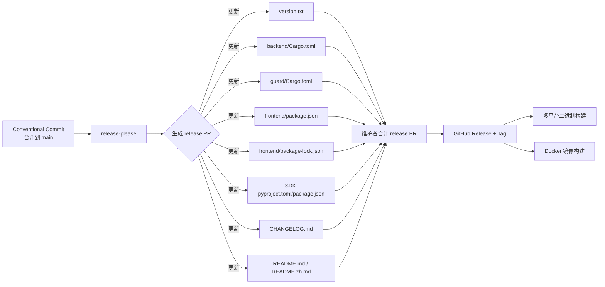
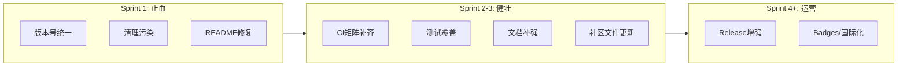

# Epicode 开源仓库成熟度提升 PRD

## 1. 项目信息

| 字段 | 内容 |
|------|------|
| Language | 中文（与用户要求一致） |
| Programming Language | Rust（Axum/Tokio）+ React 19 / TypeScript / Vite 7 / Tailwind CSS |
| Project Name | `epicode` |
| 原始需求 | 为 Epicode 开源空间 AI 记忆系统搭建“完美的开源仓库”，从代码与构建、文档、社区健康、开源运营、可维护性五个维度进行成熟度评估，识别差距并输出 PRD。 |

## 2. 产品定义

### Product Goals

1. **建立可信、一致的版本与发布机制**：消除 `version.txt`、`Cargo.toml`、`package.json`、CHANGELOG、release-please manifest 之间的版本号漂移，让任何一次 release 都能自动同步所有制品版本。
2. **恢复仓库整洁与可构建性**：清理已跟踪的临时产物，补齐 `.gitignore`，确保新贡献者 clone 后能在 10 分钟内完成本地构建与测试。
3. **降低用户与贡献者门槛**：修复 README 渲染缺陷、统一中英文内容、补齐开发者文档与安全策略，使项目符合主流开源社区的健康度预期。

### User Stories

- **作为首次访问者**，我希望 README 的快速开始能在 5 分钟内跑通，并且 API 路径示例与实际端点一致，以便快速体验 Epicode。
- **作为贡献者**，我希望仓库里没有构建产物污染、有清晰的贡献流程和可用的 CI 检查，以便放心提交 PR。
- **作为维护者**，我希望 release-please 自动更新所有版本文件并生成 Release，以避免手动同步导致版本不一致。
- **作为安全研究者**，我希望 Security Policy 中的支持版本和报告渠道是准确的，以便负责任地披露漏洞。
- **作为下游打包者**，我希望仓库中许可证声明清晰、二进制产物有校验和，以便安全地分发 Epicode。

## 3. 现状评估表

| 维度 | 评估项 | 状态 | 证据 / 备注 |
|------|--------|------|-------------|
| **代码与构建** | 版本号一致性 | ❌ 问题 | `CHANGELOG.md` 已发布 `1.0.1`；`version.txt`、`backend/Cargo.toml`、`guard/Cargo.toml`、`frontend/package.json`、SDK 均为 `1.0.0`；`.release-please-manifest.json` 为 `1.1.0`。 |
| | 构建产物清理 | ⚠️ 问题 | `epicode-changes.patch`（64 KB）、`epicode-push.bundle`（763 KB）被 Git 跟踪；本地存在 `backend/target/`、`frontend/dist/`、`frontend/node_modules/`、`.pytest_cache/`、`.workbuddy/`、`deliverables/`、`mcp-bridge/`、`skills/`。 |
| | CI 完整性 | 🟡 合格 | `.github/workflows/ci.yml` 覆盖后端 fmt/clippy/test 与前端 check/lint/test/build；但缺少 `guard`、SDK、安全扫描（cargo-audit）、覆盖率。 |
| | Release 流程 | 🟡 合格 | `release.yml` 已配置 release-please + 多平台二进制构建（Linux/macOS/Windows x86_64 + aarch64）；但 manifest 与文件版本不一致，且未包含 `version.txt`。 |
| | 多平台构建 | 🟡 合格 | 已有 cross-compile 矩阵；未做 checksum / SBOM / 签名。 |
| **文档** | README 结构 | ⚠️ 问题 | 中英文 README 架构文本块被截断/重复；中文 README 缺失“技术栈”“本地开发”“Docker 部署”“文档”“SDK”等章节；仍有旧名 `tetramem-sdk` 引用。 |
| | 开发者文档 | 🟡 合格 | `CONTRIBUTING.md`、`docs/architecture.md`、`docs/deployment.md` 已存在；但缺少本地调试、故障排查、pre-commit 等细节。 |
| | API 文档 | ✅ 优秀 | `backend/docs/openapi.yaml` 完整（671 行），`docs/api-reference.md` 已链接；但路径前缀 `/api/v1` 与 `/v1` 多处不一致。 |
| | 部署文档 | 🟡 合格 | `deploy/docker-compose.yml`、`.env.example`、Kubernetes manifest、`docs/deployment.md` 已具备。 |
| **社区健康** | 必要社区文件 | ✅ 优秀 | `CODE_OF_CONDUCT.md`、`CONTRIBUTING.md`、`SECURITY.md`、`AUTHORS.md`、`GOVERNANCE.md`、issue/PR 模板、`FUNDING.yml` 已存在。 |
| | 贡献流程 | 🟡 合格 | 已使用 Conventional Commits、PR template、issue forms；但 Code of Conduct 缺少明确举报邮箱，Security Policy 支持版本仍停留在 `0.1.x`。 |
| | 议题/PR 模板 | 🟡 合格 | 已提供 bug / feature / documentation forms；但版本号示例仍是 `0.1.0`。 |
| **开源运营** | Release 自动化 | 🟡 合格 | release-please 已配置，但 `version.txt` 未加入 `extra-files`，manifest 与 CHANGELOG 不匹配。 |
| | Changelog 规范 | 🟡 合格 | 采用 Keep a Changelog + SemVer；需与版本文件对齐。 |
| | 许可证 | ✅ 优秀 | MIT `LICENSE` 存在；`Cargo.toml` / `package.json` / SDK 均已声明 MIT。 |
| | Badges | 🟡 合格 | README 已有 CI、License、Version、Docker、Rust、React 等 badges；可补充 coverage、security、Discord。 |
| **可维护性** | 代码规范 | 🟡 合格 | 后端 `cargo fmt`/`clippy`、前端 `eslint`/`prettier` 已配置；无 `rustfmt.toml`、无全局 `clippy.toml`。 |
| | 测试覆盖 | ❌ 缺失 | 后端仅有 `brain_test.rs`、`bench_real.rs` 等 bin 文件，无单元测试；前端 `vitest` 配置 `--passWithNoTests`，无实际测试文件。 |
| | Pre-commit hooks | ❌ 缺失 | 未配置 `.pre-commit-config.yaml` / `husky` / `lint-staged`。 |
| | 依赖管理 | 🟡 合格 | Dependabot 已覆盖 backend cargo 与 frontend npm；缺少 `guard`、Python SDK、TypeScript SDK。 |

## 4. 需求池

### P0 — 必须立即修复

| ID | 需求 | 验收标准 | 优先级 |
|----|------|----------|--------|
| P0-1 | **统一版本号并修复 release-please 同步** | 1. 所有版本文件（`version.txt`、`backend/Cargo.toml`、`guard/Cargo.toml`、`frontend/package.json`、`frontend/package-lock.json`、Python `pyproject.toml`、TS SDK `package.json`）与 CHANGELOG 最新发布版本一致。 2. `.release-please-manifest.json` 与上述版本一致。 3. `.release-please-config.json` 的 `extra-files` 新增 `version.txt`；README/CHANGELOG 中的版本占位由 release-please 自动更新。 4. 提交后 release-please 能生成无冲突的 release PR。 | P0 |
| P0-2 | **清理仓库污染并加固 `.gitignore`** | 1. 从 Git 历史中移除已跟踪的 `epicode-changes.patch`、`epicode-push.bundle`（使用 `git rm --cached` 或 history rewrite，视污染程度决定）。 2. `.gitignore` 新增：`*.patch`、`*.bundle`、`.pytest_cache/`、`.workbuddy/`、`deliverables/`、`mcp-bridge/`、`skills/`、`overview.md`（如为临时产物）。 3. 运行 `git ls-files` 不再列出 build 产物、patch/bundle、缓存目录。 4. 提交后 `git status --ignored` 中上述目录显示为 ignored。 | P0 |
| P0-3 | **修复 README 架构图与中英文同步** | 1. 修复中英文 README 中 `Architecture` 文本块的截断与重复，补全数据流（→ Space / Knowledge Graph / Scheduler）。 2. 中文 README 补齐缺失章节：技术栈、本地开发、Docker 部署、文档索引、SDK。 3. 统一/删除旧名 `tetramem-sdk` 的引用；若仍需兼容说明，统一放在 SDK 章节脚注。 4. 两个 README 的章节顺序、代码示例、链接一致；CI badge / version badge 正常工作。 | P0 |
| P0-4 | **统一 API 路径前缀** | 1. 确定公开 API 前缀（建议 `/api/v1`，与 README 示例一致）。 2. 修正 `docs/api-reference.md`、`backend/docs/openapi.yaml`、后端路由、`deploy/nginx.conf`、Kubernetes ingress 中的路径描述。 3. `openapi.yaml` 的 `info.version` 与当前版本一致。 | P0 |

### P1 — 重要但可分批完成

| ID | 需求 | 验收标准 | 优先级 |
|----|------|----------|--------|
| P1-1 | **补齐 CI 矩阵** | 1. CI 新增 `guard` job：`cargo fmt --check`、`cargo clippy -- -D warnings`、`cargo test`。 2. CI 新增 Python SDK job：`ruff check`、`mypy`、`pytest`。 3. CI 新增 TypeScript SDK job：`npm ci`、`npm run build`、`tsc --noEmit`。 4. CI 集成 `cargo audit`（或 `cargo-deny`）与 `npm audit`，至少每周/PR 运行一次。 | P1 |
| P1-2 | **建立测试覆盖** | 1. 后端为核心模块（`util.rs`、空间/KV 操作、API 序列化）增加单元测试；`cargo test --all-targets` 不再为空跑。 2. 前端至少增加 1-2 个组件/工具函数测试；`vitest` 不依赖 `--passWithNoTests`。 3. （可选）接入 codecov 或类似服务，在 PR 中展示覆盖率变化。 | P1 |
| P1-3 | **补强开发者与部署文档** | 1. 新增/完善 `docs/development.md`：本地调试、环境变量、IDE 配置、常见问题。 2. `docs/deployment.md` 补充 TLS、持久化卷、监控、升级回滚、多租户注意事项。 3. 在 `docs/architecture.md` 增加 Mermaid 数据流图。 | P1 |
| P1-4 | **更新社区健康文件** | 1. `SECURITY.md` 中“Supported Versions”更新为当前主要版本，并提供漏洞报告邮箱 / GitHub Security Advisories 双渠道。 2. `CODE_OF_CONDUCT.md` 增加举报邮箱（如 `conduct@epicode.cn`）。 3. issue/PR 模板中的版本号示例更新为 `1.0.x`。 | P1 |
| P1-5 | **完善依赖管理** | 1. Dependabot 配置新增 `guard/Cargo.toml`、`backend/sdk/typescript/package.json`、`backend/sdk/python/pyproject.toml`。 2. 新增 `deny.toml` 配置 cargo-deny：禁止 copyleft 冲突、检查安全公告、限制未使用依赖。 3. 前端 CI 增加 `npm audit --audit-level=moderate`。 | P1 |
| P1-6 | **引入 Pre-commit / 提交规范** | 1. 配置 `.pre-commit-config.yaml`（推荐）或 `husky + lint-staged`：在提交前运行 `cargo fmt --check`、`cargo clippy`、`eslint --fix`、`prettier --write`。 2. 增加 commit-msg hook 校验 Conventional Commits。 | P1 |

### P2 — 锦上添花

| ID | 需求 | 验收标准 | 优先级 |
|----|------|----------|--------|
| P2-1 | **发布产物增强** | Release 附件提供 `.sha256` 校验和、SBOM（`spdx-json`）、GPG 签名或 Sigstore 签名。 | P2 |
| P2-2 | **扩展 Badges** | README 新增：coverage、cargo crate / npm version、OpenSSF Scorecard、Discord / 讨论区、all-contributors。 | P2 |
| P2-3 | **自动化 Changelog** | 在 release-please 之外，可选配置 `git-cliff` 或 Conventional Changelog Action，在 nightly 生成预览 changelog。 | P2 |
| P2-4 | **容器与 Helm 生态** | 发布官方 Docker Hub 镜像；提供 Helm Chart 与 values.yaml。 | P2 |
| P2-5 | **文档国际化** | 将核心文档（architecture、deployment、api-reference）翻译为中文，并建立 i18n 目录结构。 | P2 |

## 5. 验收标准汇总

- **P0 完成标准**：仓库无已知版本漂移；`git ls-files` 无 patch/bundle/build 产物；中英文 README 渲染正确且内容对齐；所有公开 API 示例路径一致；CI 通过。
- **P1 完成标准**：CI 覆盖 backend/guard/SDK；核心模块具备可运行的单元测试；开发者文档和部署文档覆盖本地调试与生产关键事项；社区文件信息准确；Dependabot 与 cargo-deny 接入；pre-commit 可本地安装并通过。
- **P2 完成标准**：Release 产物带校验和/SBOM；README 新增目标 badges；可选 Helm/Docker Hub 发布；核心文档中英双语。

## 6. 待确认问题

1. **目标版本号**：下一个正式发布应定为 `1.0.1`、`1.1.0` 还是其他？当前 manifest、CHANGELOG、代码文件三者不一致，需要主理人/维护者拍板。
2. **临时产物归属**：`epicode-changes.patch`、`epicode-push.bundle`、`.workbuddy/`、`deliverables/`、`mcp-bridge/`、`skills/` 是否全部为临时文件，可以删除并加入 `.gitignore`？
3. **README 同步策略**：中文 README 是手动维护，还是通过脚本/CI 自动从英文 README 生成？
4. **发布账号**：是否有 Docker Hub、crates.io、npm organization 账号用于发布官方镜像与 SDK？
5. **社区联系方式**：是否有 Discord / Slack / 微信群等社区 IM 链接用于 README badge？
6. **历史污染处理**：`epicode-push.bundle` 较大（763 KB），是否需要 `git filter-repo` 重写历史以彻底减小仓库体积，还是仅 `git rm --cached` 即可？

## 7. 建议的首个迭代范围（Sprint 1）

建议第一个可交付 sprint 集中处理 **3 个 P0**，以最快的速度让仓库回到“可信、干净、可用”的状态：

1. **P0-1 统一版本号并修复 release-please**：这是所有后续自动化的基础，先由维护者确定目标版本号后统一修改。
2. **P0-2 清理仓库污染并加固 `.gitignore`**：立即移除 patch/bundle 跟踪，避免这些文件随 release 被打包或克隆。
3. **P0-3 修复 README 架构图与中英文同步**：直接影响首次访问者的第一印象与快速开始成功率。

若 sprint 容量允许，可并行纳入 **P0-4 统一 API 路径前缀**，进一步消除“5 分钟 demo 跑不通”的风险。

## 8. 关键流程图

### Release-please 版本同步流程（目标态）

### 成熟度提升路线

---

**输出文件**：`/Users/sunorme/sunormesky-max_epicode/docs/prd/open-source-maturity-prd.md`  
**主要结论**：Epicode 已具备开源项目的“骨架”（许可证、CI、社区文件、OpenAPI、多平台 release），但当前最大的成熟度缺口集中在 **版本号漂移、仓库污染、README 渲染缺陷、API 路径不一致** 四项。优先修复这 3-4 个 P0 后，再分批补齐测试覆盖、CI 矩阵与社区运营细节，即可达到健康开源仓库的标准。
